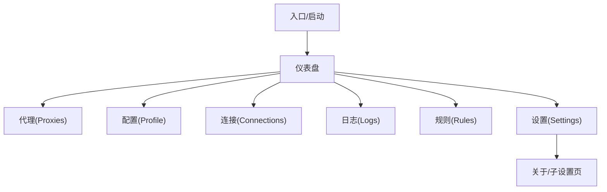

## 1. Product Overview
在保持 Clash Xiaoy 现有功能与信息结构不变的前提下，对整体 UI 做“类 iOS”风格美化。
本次优先覆盖“仪表盘（Dashboard）”与“通用组件库”，并逐步扩展到其它核心页面。

## 2. Core Features

### 2.1 Feature Module
本次改版涉及的核心页面如下：
1. **仪表盘**：流量与状态卡片、快捷操作、面板拖拽排序、系统/节点概览。
2. **代理(Proxies)**：代理组与节点浏览、延迟测试与排序、节点切换。
3. **配置(Profile)**：配置导入/管理、配置查看/编辑、应用/切换配置。
4. **连接(Connections)**：连接列表、搜索过滤、连接详情、关闭连接。
5. **日志(Logs)**：日志列表、级别/关键字过滤、清空。
6. **规则(Rules)**：规则列表浏览。
7. **设置(Settings)**：核心/端口/系统代理/界面主题等设置入口与分组浏览。

### 2.2 Page Details
| Page Name | Module Name | Feature description |
|---|---|---|
| 全局 | iOS 风格视觉系统 | 定义统一的颜色/圆角/阴影/字体层级/间距/动效规范；确保深色/浅色模式、主题色配置与现有逻辑兼容。 |
| 全局 | 通用组件外观升级（优先） | 统一改造 Button、Card、Modal/Dialog、Input、Select、Switch、Tooltip、Dropdown、Progress、ScrollArea、Sidebar/TopBar 等外观与交互状态（hover/active/focus/disabled），保持 props 与行为不变。 |
| 仪表盘 | 面板栅格与卡片容器 | 保持现有面板内容与布局策略不变；将卡片容器升级为 iOS 风格（更大圆角、柔和阴影、分层背景、可选毛玻璃）。 |
| 仪表盘 | 面板拖拽排序 | 保持拖拽阈值、排序结果持久化与可拖拽反馈不变；仅优化拖拽时的缩放/阴影/占位反馈。 |
| 仪表盘 | 状态/流量展示 | 保持流量、连接、内存、节点状态、系统信息、快捷入口等信息与刷新逻辑不变；仅统一信息层级与排版密度。 |
| 代理(Proxies) | 列表与节点卡片 | 保持代理组/节点列表、切换、延迟测试、排序筛选能力不变；优化列表密度、选中态、标签与按钮层级。 |
| 配置(Profile) | 配置管理与编辑器区域 | 保持新建/导入/查看/编辑/应用配置等行为不变；优化编辑器周边容器、操作栏按钮分组、危险操作提示样式。 |
| 连接(Connections) | 表格与详情弹窗 | 保持搜索过滤、详情查看、关闭连接行为不变；优化表格行高、分隔线、弹窗层级与信息密度。 |
| 日志(Logs) | 日志列表与过滤工具条 | 保持日志流、级别筛选、清空行为不变；优化等宽字体对比度、Badge、过滤条布局。 |
| 规则(Rules) | 规则列表 | 保持规则展示能力不变；统一列表样式与空态/错误态样式。 |
| 设置(Settings) | 设置导航与分组卡片 | 保持现有设置项、分组、保存/重置行为不变；优化导航层级、分组卡片、表单控件与说明文本排版。 |

## 3. Core Process
- 你打开应用后进入仪表盘，查看流量/连接/节点与系统状态，并可通过拖拽调整面板顺序。
- 你在代理页浏览代理组与节点，执行延迟测试/排序并切换当前节点。
- 你在配置页导入或编辑配置，并将配置应用到运行时。
- 你在连接页检索连接、查看详情并可关闭指定连接。
- 你在日志页过滤与查看日志，并可清空日志。
- 你在规则页查看规则列表。
- 你在设置页调整核心/端口/系统代理/界面主题等配置。

