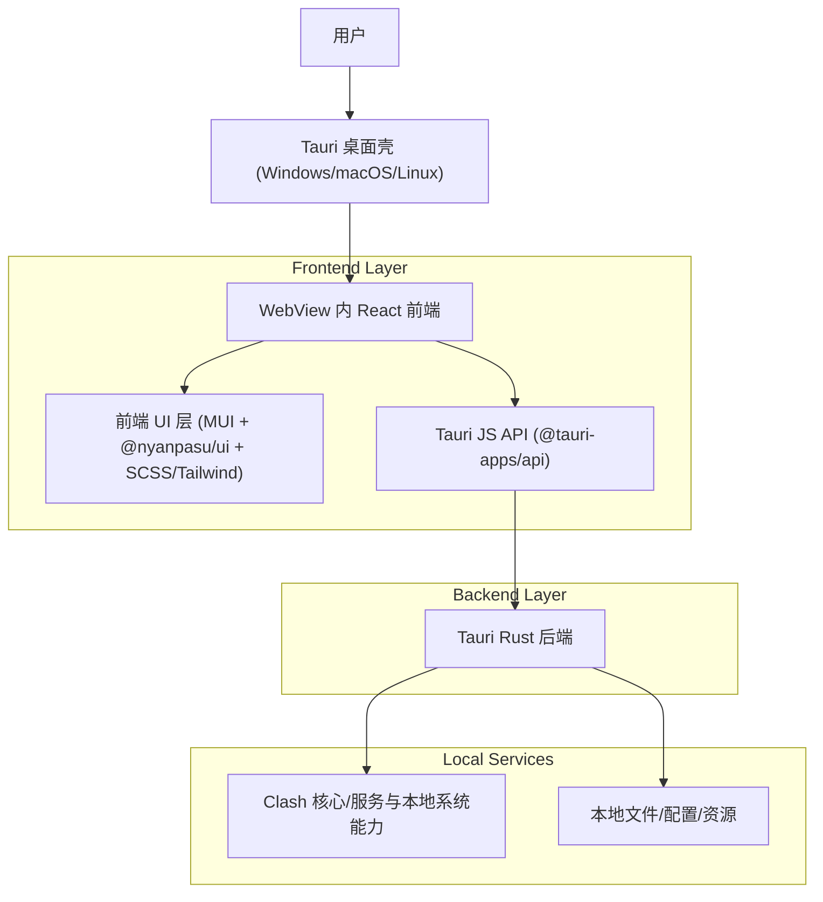

## 1.Architecture design

## 2.Technology Description

- Frontend: React@19 + TypeScript + Vite + @tanstack/react-router
- UI: @mui/material + Radix UI + @nyanpasu/ui + SCSS Modules + TailwindCSS@4
- Desktop Runtime: Tauri@2 (Rust)
- Data Fetching/State: swr + jotai（保持现状）
- Backend: Tauri Rust（现有 IPC/事件/本地能力；本次 UI 改版不新增后端服务）

## 3.Route definitions

| Route                     | Purpose                                         |
| ------------------------- | ----------------------------------------------- |
| /                         | 启动入口，根据开关跳转到实验路由或记忆页/仪表盘 |
| /(legacy)/dashboard       | 旧版仪表盘（面板拖拽、流量/状态卡片）           |
| /(legacy)/proxies         | 旧版代理管理与节点切换                          |
| /(legacy)/profiles        | 旧版配置管理与编辑                              |
| /(legacy)/connections     | 旧版连接列表与操作                              |
| /(legacy)/logs            | 旧版日志浏览与过滤                              |
| /(legacy)/rules           | 旧版规则列表                                    |
| /(legacy)/settings        | 旧版设置总览与子项                              |
| /experimental/dashboard   | 实验版仪表盘入口（开关启用时）                  |
| /experimental/settings/\* | 实验版设置与子页（开关启用时）                  |

## 4.API definitions (If it includes backend services)

本项目通过 Tauri 的“命令调用/事件”完成前后端通信；本次仅做 UI 美化，不新增/变更 IPC 契约。

- 前端：`@tauri-apps/api` 调用命令、订阅事件
- 后端：Rust 侧提供命令与事件分发，驱动核心状态与本地系统能力

## 6.Data model(if applicable)

本次 UI 改版不引入数据库与新数据实体；保持现有本地存储/配置结构不变。
